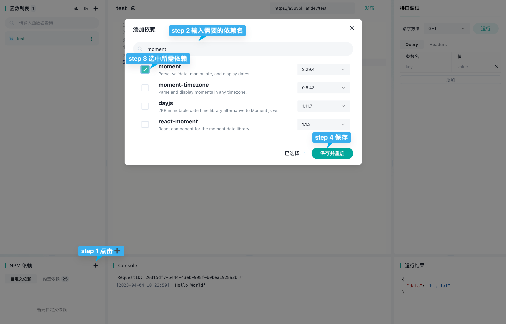
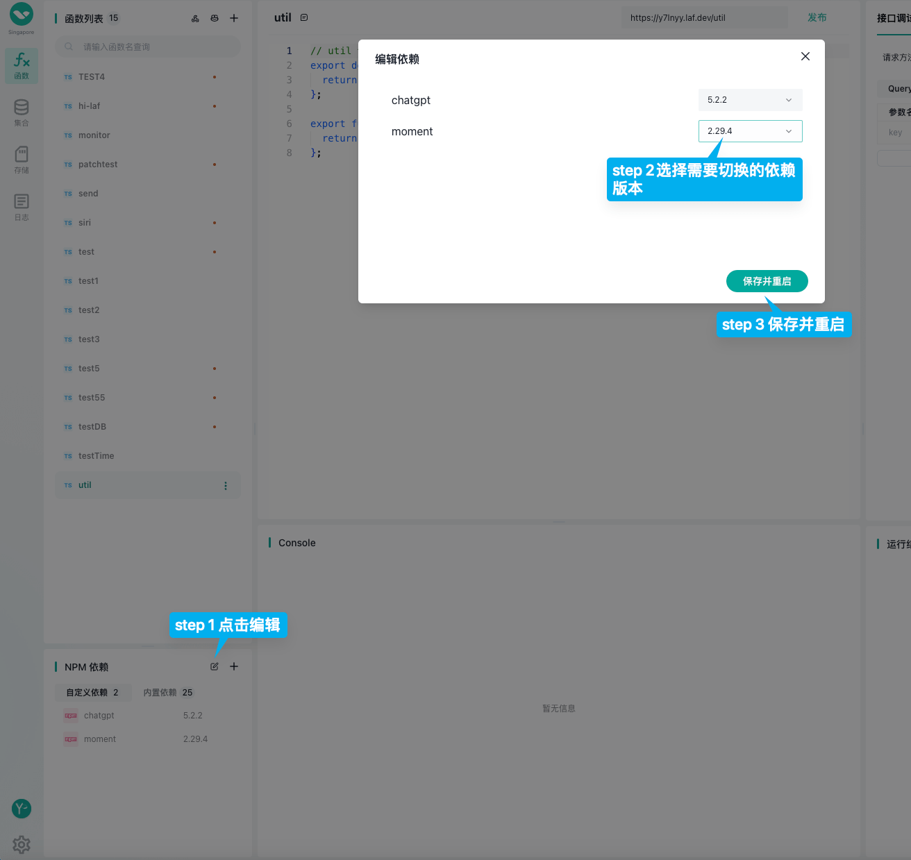
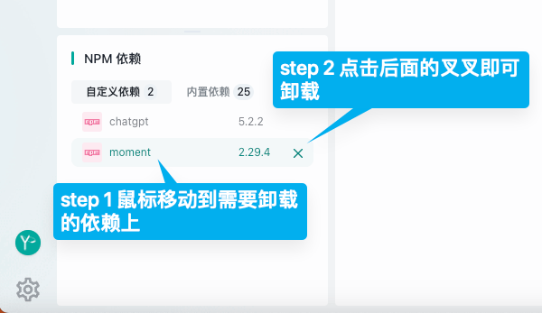

# {{ $frontmatter.title }}

应用开发过程中，通常有添加 `npm` 依赖的需求，`laf` 提供了在线可视化管理这些第三方包模块的方法，用户可非常方便的进行搜索、安装、升级和卸载。

::: warning
Laf 云开发可安装来自 <https://www.npmjs.com/> 的依赖，如果所需依赖无法在该网站中找到，是无法安装的
:::

## 添加依赖



如上图所示，我们依次点击屏幕左下方的 `NPM 依赖`、添加按钮，搜索想要安装的包名（此处以 [moment](https://www.npmjs.com/package/moment) 为例），勾选后点击 `保存并重启` 按钮即可。

> 安装的持续时间会根据包的大小和网络情况而不同，请耐心等待完成。


安装完成后用户可在界面左下方 `依赖管理` 中查看已安装的依赖和版本。

## 自定义源

环境变量中添加：`NPM_INSTALL_FLAGS="--registry=https://registry.npmmirror.com` 即可添加淘宝源，也可以换成其他的源

:::tip
如果需要安装`sharp`这个依赖，可以使用这个环境变量，可以极快的完成安装:

`NPM_INSTALL_FLAGS="--registry=https://registry.npmmirror.com --canvas_binary_host_mirror=https://npmmirror.com/mirrors/canvas --sharp_binary_host=https://npmmirror.com/mirrors/sharp --sharp_libvips_binary_host=https://npm.taobao.org/mirrors/sharp-libvips"`
:::

## 依赖版本选择


为保证用户应用稳定性，`Laf` 不会自动更新应用的 `Npm package` 版本。

添加依赖时，默认勾选为最新版`latest`，用户如需指定版本，可在安装时在版本下拉框中选择对应版本。

## 云函数使用

安装完成后，即可在云函数中引入并使用。例如，创建一个云函数 `hello-moment`，并修改代码如下：

```typescript
import cloud from '@lafjs/cloud'
import moment from 'moment'

export async function main(ctx: FunctionContext) {
  const momentVersion = moment.version
  const now = moment().format('YYYY-MM-DD hh:mm:ss')
  const twoHoursLater = moment().add(2, 'hours').format('YYYY-MM-DD hh:mm:ss')
  
  return { momentVersion, now, twoHoursLater}
}
```

点击界面右方运行按钮或按下 `Ctrl + S` 保存，可看到运行结果：

```json
{
  "momentVersion": "2.29.4",
  "now": "2023-02-08 02:14:05",
  "twoHoursLater": "2023-02-08 04:14:05"
}
```

## 切换已安装依赖版本



## 卸载已安装依赖版本


